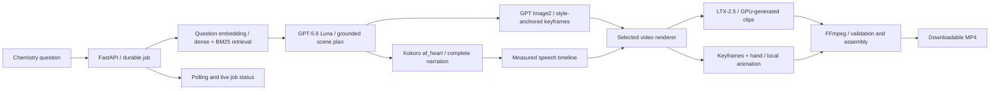

# Detailed setup and operations

An asynchronous FastAPI backend that turns chemistry questions into narrated educational
whiteboard videos. The service retrieves evidence from a chemistry PDF corpus, creates a
scene plan and keyframes, animates the whiteboard sequence, and delivers an MP4 with complete
Kokoro narration. Choose local keyframe composition or the integrated LTX-2.5 renderer.

**Best videos:** the best generated videos and their input questions are stored in
[examples/videos/](../examples/videos/).

[Setup](#setup) · [API walkthrough](#api-walkthrough) · [Whiteboard animation](#whiteboard-animation) ·
[Repository layout](#repository-layout) · [Troubleshooting](#troubleshooting)

## How it works



The API returns a job ID promptly while background workers perform generation. PostgreSQL
persists jobs, embeddings and source provenance. Artifact files preserve scripts, media,
render graphs and provider receipts. No frontend is included.

## Whiteboard animation

The generation mode is `whiteboard_loop`:

**Blank → draw → show and explain → erase → draw the next keyframe.** The supplied hand
reference accompanies the drawing phase. Each diagram stays visible for its explanation,
then the board clears before the next scene.

Select the renderer through `VIDEO_RENDERER`:

| Renderer | Behavior |
| --- | --- |
| `keyframe-composite-v1` | Locally composes the generated diagrams with a moving hand, progressive reveal and clean erase transition. Preserves exact diagram text and avoids new GPU inference. |
| `ltx` | Generates drawing and erasing clips through LTX-2.5, with hand references, pinned start images and temporal end guides. |

Renderer identity is recorded in job settings and output provenance. Composed scenes are
identified as composition of generated images; they are not described as fresh LTX inference.

The videos use educational doodles, black marker outlines, restrained color accents and the
supplied whiteboard style anchor. The LTX profile uses full BF16 weights,
two-stage spatial refinement and versioned settings in
[workflows/video/render-profile.json](../workflows/video/render-profile.json).

Kokoro `af_heart` speaks every scene's complete narration at normal speed. Measured WAV sample
counts determine timing. Narration stays with the current scene: its exact keyframe is shown
for at least two seconds and longer when speech needs it. Erasing begins after the speech
finishes, and the next scene's narration starts with its drawing. Narration is never compressed or truncated.
Final audio contains **Kokoro narration only**,
with no background music or native LTX soundtrack.

## Requirements

- Docker Desktop with Linux containers and Docker Compose.
- Python **3.12**, [uv](https://docs.astral.sh/uv/), Git, OpenSSH and PowerShell 7 (`pwsh`).
- FFmpeg and FFprobe on the host PATH for local media tests and scene probes. The API
  container already includes both tools.
- An OpenAI key with access to `gpt-5.6-luna`, `gpt-image-2` and `text-embedding-3-large`.
- A RunPod GPU environment: this project uses **one A100 80 GB**, a 50 GB container disk
  and a 250 GB persistent volume.
- A Hugging Face read token with access to the pinned model repositories.
- The assessment's original chemistry PDFs, supplied separately from the code.

All commands below run from the repository root and use PowerShell. The application runs
inside Linux containers, including on a Windows host.

## Setup

### 1. Place the materials and configure the project

Clone the repository into your workspace, then enter it:

```powershell
git clone https://github.com/mikhailbovt/talotrace_assessment.git
Set-Location talotrace_assessment
```

Keep the supplied PDFs beside the repository:

```text
workspace/
├── material/
│   ├── challenge/                  # Assessment PDF
│   └── chem_material/Individual/   # Original chemistry PDFs
└── talotrace_assessment/           # This repository
    ├── assets/references/
    │   ├── style_anchor.png
    │   ├── hand_reference.png
    │   └── blank_whiteboard.png
    ├── examples/videos/
    └── README.md
```

The visual references are included in the repository. Their source checksums are in
[configs/references.json](../configs/references.json); the portable blank plate and its provider
receipt are bound by [configs/blank_whiteboard.json](../configs/blank_whiteboard.json).
Preserve the original PDF bytes because
citations and extraction reviews are tied to file hashes and physical pages.

```powershell
uv sync --frozen
if (-not (Test-Path .env)) { Copy-Item .env.example .env }
```

Edit `.env` using [.env.example](../.env.example):

| Setting | Value or purpose |
| --- | --- |
| `OPENAI_API_KEY` | Your project key for visual transcription, embeddings, direction and keyframes. |
| `POSTGRES_PASSWORD` | A local database password; use the same value in `DATABASE_URL`. |
| `DATABASE_URL` | Host-side ingestion connection, normally PostgreSQL at `127.0.0.1:15432`. |
| `MATERIALS_DIR` | Normally `../material`. |
| `ARTIFACTS_DIR` | Normally `./data/tests`; all test media is written here. |
| `COMFYUI_URL` / `KOKORO_URL` | SSH tunnel endpoints on ports `18188` / `18081`. |
| `VIDEO_RENDERER` | Use `keyframe-composite-v1` for local whiteboard composition, or `ltx` for GPU inference. |
| `VIDEO_WORKER_ENABLED` | Set `true` when Kokoro and the selected renderer are ready. |

Keep the selected model IDs and `KOKORO_VOICE=af_heart`. Unavailable models fail explicitly;
there is no silent substitution. `.env` and optional `.env.local` are ignored by Git and
excluded from Docker images. Local project configuration takes precedence over an unrelated
API key inherited from the host process.

Keep shared configuration in `.env`, which the RAG CLI reads directly. Use a URL-safe database
password containing letters, digits, hyphens and underscores; Compose also inserts this
password into its internal database connection URL.

Compose supplies internal container URLs and routes GPU requests through
`host.docker.internal`. Keep the host-side `DATABASE_URL` for the ingestion commands.

### 2. Start storage and prepare the corpus

```powershell
docker compose up -d --wait --wait-timeout 120 postgres redis
uv run python -m talotrace.retrieval inspect
uv run python -m talotrace.retrieval.vision --concurrency 6
uv run python scripts/audit-rag-vision.py
uv run python -m talotrace.retrieval prepare
uv run python -m talotrace.retrieval register
uv run python -m talotrace.retrieval ingest
uv run python -m talotrace.retrieval validate
uv run python -m talotrace.retrieval activate
uv run python -m talotrace.retrieval smoke
uv run python -m talotrace.retrieval status
```

`pdf-inspector` supplies clean page text. Failed or reviewed problematic pages are rendered
and transcribed with GPT-5.6 Luna visual input. Images, responses, warnings and usage are
cached; diagnostic pypdf output does not supply answer text. The supplied corpus produces
83 documents, 481 physical pages and 637 answer chunks, including 185 visual transcriptions.

Chunks and questions use `text-embedding-3-large` at 3072 dimensions. Exact cosine retrieval
and BM25 are combined with reciprocal rank fusion. Activation requires complete embeddings,
verified extraction and the three assessment retrieval checks. Generation is rejected until
this corpus gate passes.

Re-running these stages resumes from valid caches and embeds only missing inputs. Vision
and embedding calls are billable when inputs are missing. Preserve `data/rag/`,
`data/tests/rag/` and the database volume to reuse paid work. PostgreSQL is the durable queue;
Redis is provisioned but is not the current queue implementation.

See [RAG reproduction and source limitations](rag.md) and
[recorded RAG validation and usage](rag-status.md). Custom corpus locations require the
CLI's `--corpus` option as documented there, in addition to the Docker material mount.

### 3. Set up RunPod and the SSH tunnel

Follow the [RunPod setup guide](runpod.md) to provision the A100, install the pinned
models and start private ComfyUI/MSR and Kokoro services. The bootstrap downloads roughly
82 GB of model files and verifies file sizes and available SHA256 checksums.

Update `infra/runpod/pod.json` with **your pod's current SSH host and port**, then run:

```powershell
pwsh -File scripts/runpod-tunnel.ps1 -Check
pwsh -File scripts/runpod-tunnel.ps1
```

Keep the tunnel in a separate terminal. Check the forwarded services:

```powershell
Invoke-RestMethod http://127.0.0.1:18188/system_stats
Invoke-RestMethod http://127.0.0.1:18081/health
```

Only SSH is publicly exposed. ComfyUI and Kokoro bind to the pod's loopback interfaces;
the tunnel makes them available to the host and API container.

### 4. Start the API

For the fast composition path, set `VIDEO_RENDERER=keyframe-composite-v1` and
`VIDEO_WORKER_ENABLED=true` in `.env`, then:

```powershell
docker compose up -d --build --wait --wait-timeout 120
Invoke-RestMethod http://127.0.0.1:8000/health/live
Invoke-RestMethod http://127.0.0.1:8000/health/ready
```

Interactive documentation: **http://127.0.0.1:8000/docs**.
`/health/ready` checks control-plane dependencies; it does not replace a generation test.
Keep the video worker disabled when reserving the GPU for an isolated experiment. Keyframe
jobs and status endpoints remain independently usable.

## API walkthrough

### Submit a question

```powershell
$baseUrl = 'http://127.0.0.1:8000'
$body = @{
    question = 'How does the pH scale work?'
    keyframe_count = 5
    mode = 'whiteboard_loop'
} | ConvertTo-Json

$job = Invoke-RestMethod -Method Post -Uri "$baseUrl/v1/video-jobs" `
    -Headers @{'Idempotency-Key'='ph-example-whiteboard-v1'} `
    -ContentType 'application/json' -Body $body
$job
```

HTTP **202** returns a durable video job ID, upstream keyframe job ID and status/result
URLs. `whiteboard_loop` is the default when `mode` is omitted. Choose five to ten keyframes.
Reuse the same idempotency key for retries of the same
request; use a new key for an intentional new generation. Changed inputs under an existing
key return HTTP **409**.

### Follow status and download the result

```powershell
Invoke-RestMethod ($baseUrl + $job.status_url)
Invoke-RestMethod "$baseUrl/v1/video-jobs"
$result = Invoke-RestMethod ($baseUrl + $job.result_url)
```

Jobs progress through keyframe preparation, speech synthesis, rendering and assembly, then
reach `video_completed`, `failed` or `interrupted`. Status includes upstream progress,
scene/phase information and safe errors. Polling and live observers are independent of the
background generation job. To watch server-sent events:

```powershell
curl.exe --no-buffer "$baseUrl/v1/video-jobs/$($job.id)/events"
```

The stream sends the current snapshot, changed states/progress, heartbeat comments and a
terminal event. Closing it leaves generation running; reconnecting returns the latest state.
See [live status semantics](job-status.md) and the [video API](video-api.md).

When `video_generated` is true, download the MP4 into the test-artifact directory:

```powershell
$result = Invoke-RestMethod ($baseUrl + $job.result_url)
if ($result.video_generated) {
    New-Item -ItemType Directory -Force data/tests/downloads | Out-Null
    Invoke-WebRequest ($baseUrl + $result.video_url) `
        -OutFile "data/tests/downloads/$($job.id).mp4"
}
```

The manifest records the measured timeline, source/reference hashes, generation settings,
clip receipts and media validation. The download endpoint verifies file integrity.

### Render from an existing keyframe job

```powershell
$reuseBody = @{
    keyframe_job_id = $job.keyframe_job_id
    mode = 'whiteboard_loop'
} | ConvertTo-Json

$reusedJob = Invoke-RestMethod -Method Post -Uri "$baseUrl/v1/video-jobs" `
    -Headers @{'Idempotency-Key'='ph-existing-keyframes-whiteboard-v1'} `
    -ContentType 'application/json' -Body $reuseBody
```

This starts a video job using the existing plan and images, including an approved, hash-bound
narration review when present. To prepare images first, use `POST /v1/keyframe-jobs` with `question` and
`keyframe_count`; see the independent [keyframe API](keyframe-api.md).

### Resume a failed or interrupted job

```powershell
Invoke-RestMethod -Method Post "$baseUrl/v1/video-jobs/$($job.id)/resume"
```

Resume is explicit, with at most three attempts. Resume a failed upstream keyframe job first.
Valid saved speech, images and clips are reused. An unresolved Comfy submission is recovered
through its saved identity instead of blindly dispatching a duplicate. Changed inputs or
approved reviews require a new job.

## Verification and reproducibility

```powershell
uv run ruff check src tests scripts infra/runpod
uv run pytest -q
docker compose config --quiet
```

Tests cover extraction/cache integrity, grounding, asynchronous API behavior, recovery,
narration preservation and real FFmpeg assembly. Live scripts write evidence under `data/tests/`:

| Script | Purpose |
| --- | --- |
| `scripts/smoke_keyframes.py` | Three assessment questions, image integrity and idempotent replay; requires the expected corpus ID. |
| `scripts/probe_video_scene.py` | One real LTX/Kokoro scene before rendering a full lesson. |
| `scripts/smoke_videos.py` | Full whiteboard lesson using an existing keyframe job. |
| `scripts/check_live_status.py` | Read-only HTTP/SSE check of an existing job. |
| `scripts/ltx-text-test.py` | Separate text-only LTX experiment. |

Use `--help` for arguments. New keyframes use paid OpenAI services; LTX rendering uses the
shared GPU. Composition from existing keyframes needs Kokoro and local FFmpeg. Keep one GPU
render at a time. Input identities, pinned revisions, seeds where supported and receipts
make runs traceable; fresh stochastic generations are not promised to be byte-identical.
A response lost after billing but before persistence can still require a charged retry.

When an image needs a scientific correction, the [reviewed revision workflow](keyframe-revisions.md)
preserves the original job and regenerates only the changed scenes after checking their
source, prompt and image hashes.

Review actual images and video frames for chemical labels, electron counts, legibility,
clear drawing/reveal and erasing phases, narration timing and continuity. Exact physical
alignment between every marker stroke and newly visible pixel is not an acceptance requirement.
Container integrity alone does not certify scientific accuracy or visual quality. Detailed
results are in [setup status](setup-status.md), [RAG evidence](rag-status.md) and
[the text-only LTX report](ltx-text-test.md).

## Repository layout

| Path | Contents |
| --- | --- |
| `src/talotrace/api/` | Requests, status, live observers and artifact delivery. |
| `src/talotrace/jobs/` | Durable queues, workers, validation and resume. |
| `src/talotrace/retrieval/` | PDF extraction, visual transcription, embeddings and hybrid search. |
| `src/talotrace/providers/` | OpenAI, Kokoro and Comfy/LTX adapters. |
| `src/talotrace/artifacts/` | Atomic storage, media assembly and validation. |
| `assets/references/` | Versioned style anchor, hand reference and blank whiteboard. |
| `configs/` | Source inventories, extraction reviews and generation configuration. |
| `infra/postgres/` / `infra/runpod/` | Database migrations and GPU deployment. |
| `workflows/` | Render profiles and isolated workflows. |
| `scripts/` / `tests/` | Repeatable operational checks and automated tests. |
| `data/rag/` | Local inspection and immutable prepared snapshots; ignored by Git. |
| `data/tests/` | All generated test media, receipts and review evidence; ignored by Git. |
| `examples/videos/` | Best generated videos and their original questions. |
| `docs/` | Architecture, detailed usage and verified evidence. |

The assessment questions are:

1. How does the pH scale work?
2. Why do atoms form covalent bonds?
3. What is the difference between ionic and covalent bonding?

## Troubleshooting

| Symptom | Check |
| --- | --- |
| Generation returns HTTP 503 | Corpus `status` and preparation/activation checks; incomplete or old corpora are rejected. |
| Video waits while keyframes progress | Expected upstream work; inspect `keyframes_status_url`. |
| Keyframes finish but video stays queued | `VIDEO_WORKER_ENABLED`, worker status and the SSH tunnel. |
| Comfy/Kokoro is unreachable | Pod state, current address in `pod.json`, tunnel and remote services. |
| OpenAI fails | Project key, access to the selected models and the saved safe error/receipt. |
| HTTP 409 on submit/resume | Idempotency identity, changed review/settings, state and attempt limit. |
| Job is `interrupted` | Restore dependencies, inspect saved artifacts and explicitly resume. |

Use `docker compose ps` and `docker compose logs --tail=100 api` for local diagnosis.
See [architecture](architecture.md) for worker ownership and failure boundaries.

For source reload on Windows, keep the application in Linux:

```powershell
docker compose -f docker-compose.yml -f docker-compose.dev.yml up -d --build
```

Use reload mode between generation runs because source changes restart workers. Docker
avoids the conflicting Windows event-loop requirements of async PostgreSQL and FFmpeg.

## Stop the environment

```powershell
docker compose down
```

Named database volumes remain intact. Stop the tunnel with Ctrl+C in its terminal. Stop or
terminate the pod in RunPod when it is no longer needed; persistent storage can continue
billing after a stop. Preserve required artifacts before termination. Revoke session-specific
OpenAI/Hugging Face credentials and remove the dedicated RunPod SSH key after the recording
or assessment session. Cleanup and credential revocation are explicit operator actions.
